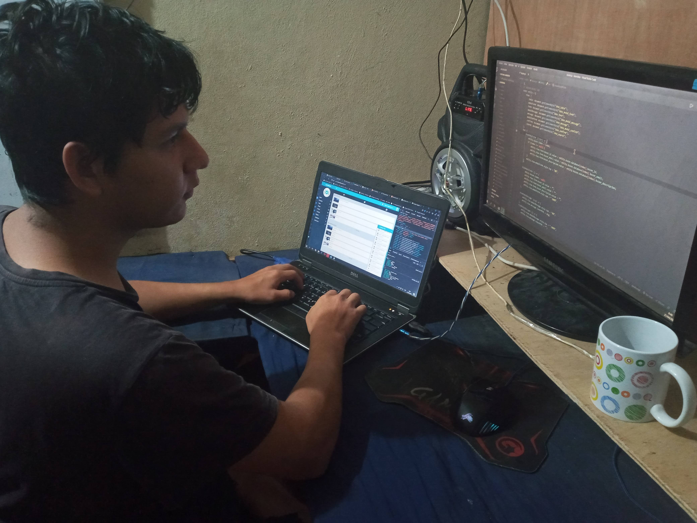
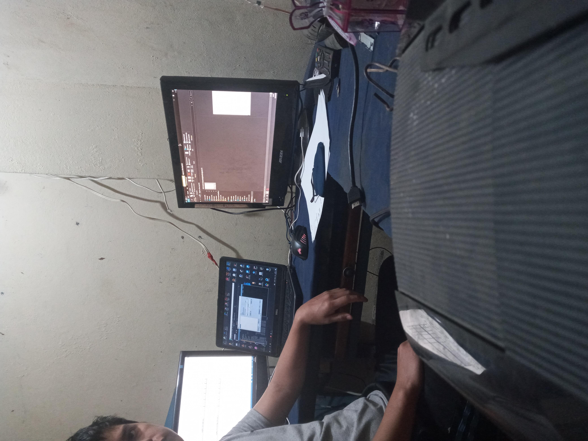

  

    
     
    <h2 style="margin: 18px 0 6px; font-weight: 700; letter-spacing: -0.4px;">🚀 Fullstack Developer</h2>
    
Laravel • React • Inertia.js • TypeScript

  

  

  

    Desarrollador enfocado en crear soluciones web escalables y de alto rendimiento. Actualmente me especializo en el ecosistema <b>Laravel + React + Inertia.js</b> con enfoque en performance y DX.
  

  

    
    
    
    
    
  

  

    

      <h3 style="margin: 0 0 10px;">🛠️ Mi Stack Técnico</h3>
      <ul style="margin: 0; padding-left: 18px; color: #1f2937;">
        <li><b>Backend:</b> Laravel, MySQL, REST APIs</li>
        <li><b>Frontend:</b> React (Inertia.js), TypeScript, Vite</li>
        <li><b>Diseño:</b> Tailwind CSS, UI/UX moderno</li>
        <li><b>Herramientas:</b> Git, Composer, NPM, Docker</li>
      </ul>
    

    

      <h3 style="margin: 0 0 10px;">📈 Proyectos Actuales</h3>
      <ul style="margin: 0; padding-left: 18px; color: #1f2937;">
        <li><b>Proposal Builder:</b> Generador dinámico de propuestas con JSON.</li>
        <li><b>Modern Architecture:</b> Monolitos modernos y escalables.</li>
        <li><b>Performance:</b> Core Web Vitals y SEO técnico.</li>
      </ul>
    

  

  

    <h3 style="margin-bottom: 12px;">📊 Estadísticas de GitHub</h3>
    
    
  

  

    
    
  

